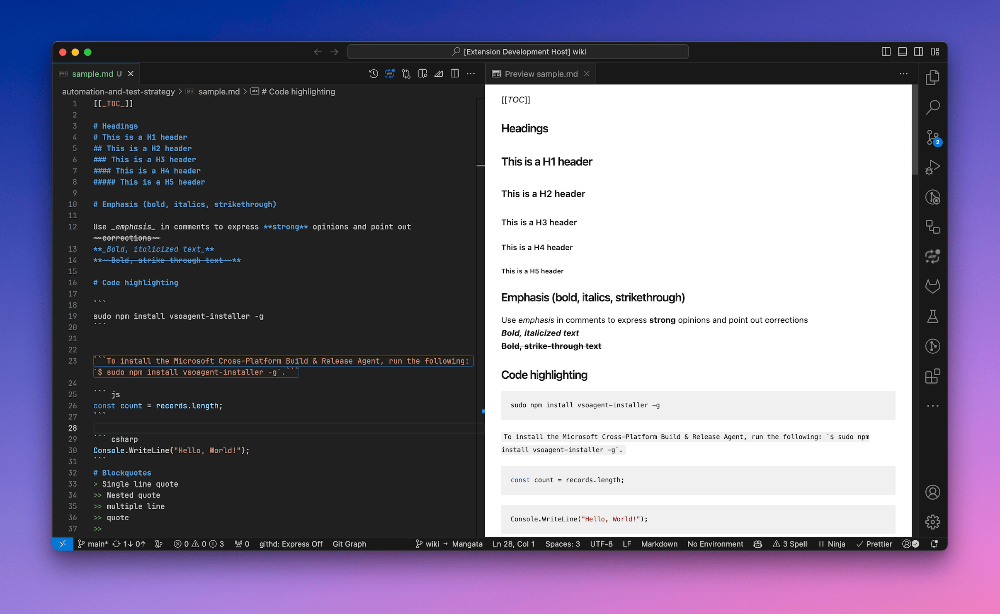

A VSCode extension to preview markdown files in Azure DevOps Wiki style.
Great for previewing your wiki pages in VSCode if you/your team are publishing code to Azure DevOps Wiki.

# Usage
This should work automatically as you preview your markdown file. However, if you facing any issues, please see the [VSCode Markdown Preview](https://code.visualstudio.com/Docs/languages/markdown#_markdown-preview) documentation for instructions on how to use this extension.

# Unsupported Azure DevOps Wiki Features
- `[[_TOC_]]` and `[[_TOSP_]]` tags.
- [Embedded Azure Boards queries](https://learn.microsoft.com/en-us/azure/devops/project/wiki/markdown-guidance?view=azure-devops#embed-azure-boards-query-results-in-wiki).
- [Embedded videos](https://learn.microsoft.com/en-us/azure/devops/project/wiki/markdown-guidance?view=azure-devops#embed-videos-in-a-wiki-page).
- @mention users and groups.
No checks were done for broken links.
- Mermaid diagrams are not rendered correctly.
